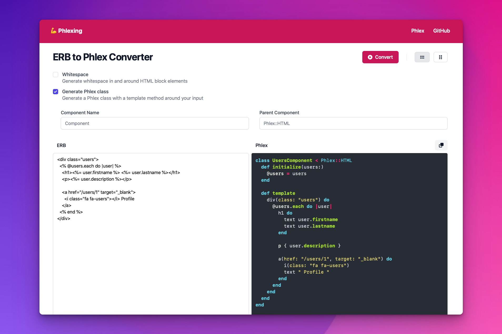

# Phlexing

[](https://github.com/marcoroth/phlexing/actions/workflows/tests.yml)
[](https://github.com/marcoroth/phlexing/actions/workflows/rubocop.yml)

A simple ERB to [Phlex](https://www.phlex.fun) Converter.

<a href="https://phlexing.fun">
  
</a>

## Website

A hosted version of the converter is running at [https://phlexing.fun](https://phlexing.fun).


## Using the gem

### Installation

Install the gem and add to the application's Gemfile by executing:

    $ bundle add phlexing

If bundler is not being used to manage dependencies, install the gem by executing:

    $ gem install phlexing

### Basic Usage

```ruby
require "phlexing"

Phlexing::Converter.convert(%(<h1 class="title">Hello World</h1>))
```

##### Output

```ruby
h1(class: "title") { "Hello World" }
```

### Converter Options

| Option | Type | Default Value | Description |
| --- | --- | --- | --- |
| `whitespace` | `Boolean` | `true` | Generate whitespace in and around HTML block elements. |
| `component` | `Boolean` | `false` | Generate a Phlex class with a `view_template` method around your input. |
| `component_name` | `String` | `"Component"` | The name of your Phlex class. |
| `parent_component` | `String` | `"Phlex::HTML"` | The name of the parent class your Phlex class will inherit from. |
| `svg_param` | `String` | `"s"` | The name of the block argument Phlex will use to generate SVG-specific elements. |
| `template_name` | `String` | `"view_template"` | The name of the generated template method in your Phlex class. |

### Multi-line HTML

```ruby

Phlexing::Converter.convert(<<~HTML)
  <% @articles.each do |article| %>
    <h1><%= article.title %></h1>
  <% end %>
HTML
```

##### Output

```ruby
@articles.each { |article| h1 { article.title } }
```

### Component class

```ruby
Phlexing::Converter.convert(<<~HTML, component: true)
  <h1><%= @user.name %></h1>

  <p><%= posts.count %> Posts</p>
HTML
```

##### Output
```ruby
class Component < Phlex::HTML
  attr_accessor :posts

  def initialize(posts:, user:)
    @posts = posts
    @user = user
  end

  def view_template
    h1 { @user.name }

    p do
      text posts.count
      text %( Posts)
    end
  end
end
```

### Rails Helpers

```ruby
Phlexing::Converter.convert(%(<%= link_to "Home", root_path %>), component: true)
```

##### Output
```ruby
class Component < Phlex::HTML
  include Phlex::Rails::Helpers::LinkTo
  include Phlex::Rails::Helpers::Routes

  def view_template
    link_to "Home", root_path
  end
end
```

### Private component methods

```ruby
Phlexing::Converter.convert(%(<% if active? %>Active<% else %>Inactive<% end %>), component: true)
```

##### Output
```ruby
class Component < Phlex::HTML
  def view_template
    if active?
      text "Active"
    else
      text "Inactive"
    end
  end

  private

  def active?(*args, **kwargs)
    # TODO: Implement me
  end
end
```

### ERB Attribute interpolation

```ruby
Phlexing::Converter.convert(%(<div style="background: <%= active? ? "green" : "gray" %>"></div>))
```

##### Output

```ruby
div(style: %(background: #{active? ? "green" : "gray"}))
```

### Development

After checking out the repo, run `bin/setup` to install dependencies. Then, run `rake test` to run the tests. You can also run `bin/console` for an interactive prompt that will allow you to experiment.

To install this gem onto your local machine, run `bundle exec rake install`. To release a new version, update the version number in `version.rb`, and then run `bundle exec rake release`, which will create a git tag for the version, push git commits and the created tag, and push the `.gem` file to [rubygems.org](https://rubygems.org).

### Contributing

Bug reports and pull requests are welcome on GitHub at https://github.com/marcoroth/phlexing. This project is intended to be a safe, welcoming space for collaboration, and contributors are expected to adhere to the [code of conduct](https://github.com/marcoroth/phlexing/blob/master/CODE_OF_CONDUCT.md).

### License

The gem is available as open source under the terms of the [MIT License](https://opensource.org/licenses/MIT).

### Code of Conduct

Everyone interacting in the Phlexing project's codebases, issue trackers, chat rooms and mailing lists is expected to follow the [code of conduct](https://github.com/marcoroth/phlexing/blob/master/CODE_OF_CONDUCT.md).
